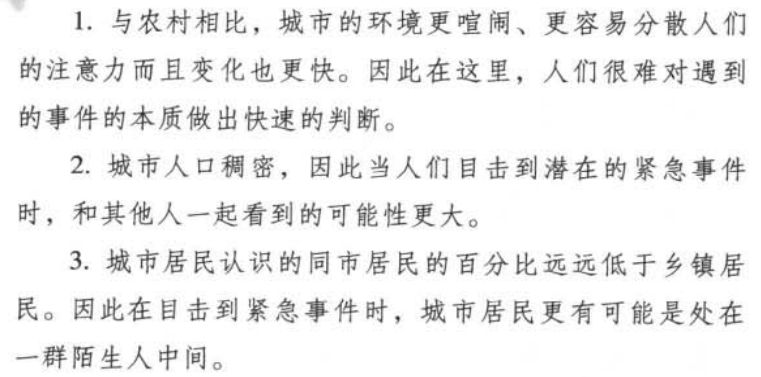
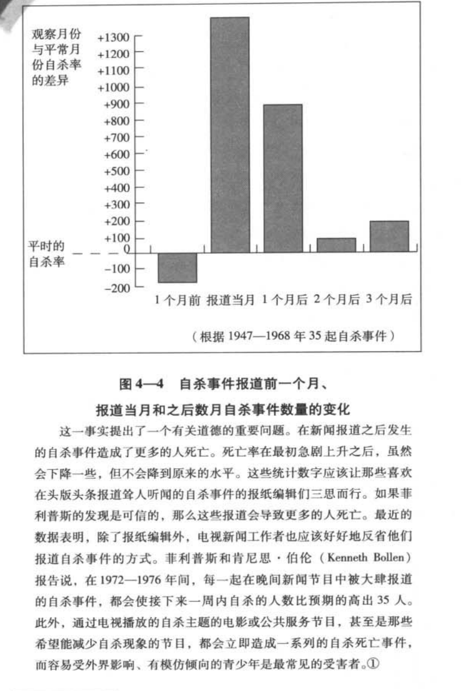
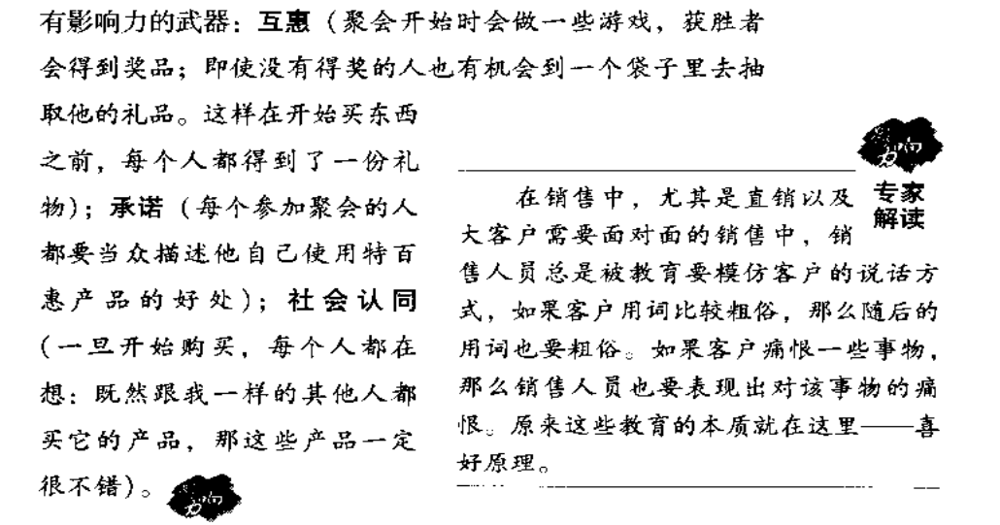
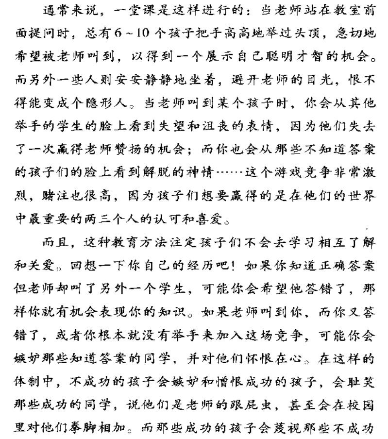
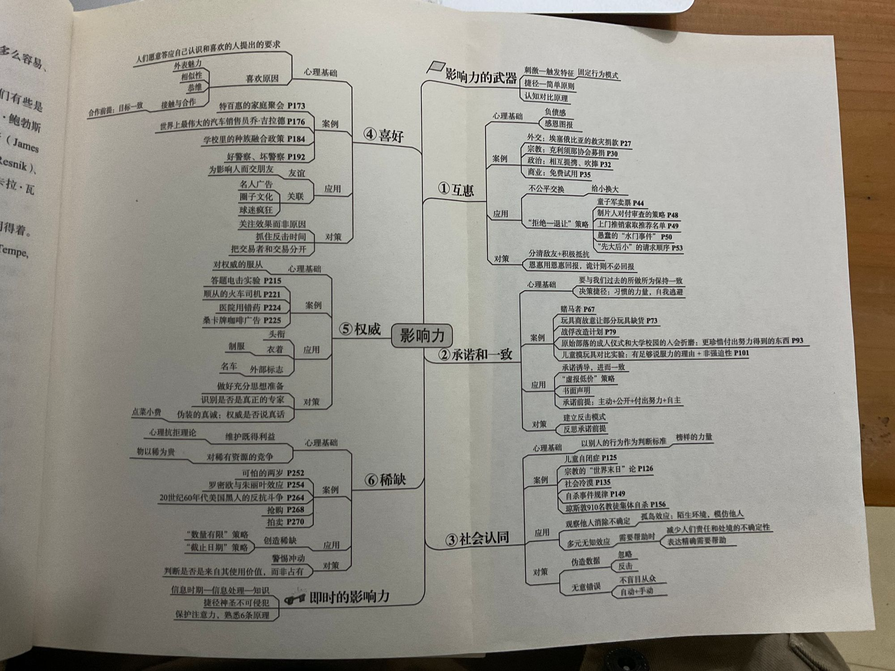

# 《影响力》

## 第1章：影响力的武器——武装自己

### 1.按一下就播放

**固定行为模式：**每次构成模式的所有行为几乎都是按照相同的方式、相同的顺序发生的。**触发者并不是对手这个整体，而是对手具备的一些特征。**

tips：**我们在要别人帮忙的时候，要是能给一个理由，成功的概率会更大**

加入"因为"这个词，即使没有真正合理的原因，也能得到帮忙。

```
案例1：无人问津的东西，价格乘以2后反而被一抢而空

生活富裕的度假客，经验告诉他们，**一分钱一分货，价格贵=东西好**
```

文明的进步，就是人们在不假思索中可以做得事情越来越多——阿尔弗·诺思·怀特黑德

tips：贪图**优惠券**的人，觉得它省钱也节省了思考如何去做的时间和精力。

### 2.渔利的奸商

模仿触发特征，激起自动响应机能

客户问价格，抬高价格，假装听不见，然后给一个较低价，客户就会以为听错占了便宜。

### 3.以柔克刚

1. 有能力激起一种近乎机械化的过程
2. 掌握触发这种过程的能力，能从中获利
3. 借助这种武器，令人乖乖就范

> **对比原理**：一只手放冷水，一只手放热水，同时放回常温，会觉得前者放入了热水，后者放入了冷水。基于前面发生事件的性质，相同的东西会显得不一样

tips：先卖贵的，其他的东西跟贵的一比就不值一提了。

```
案例2 先带客户看几套高价破房子，然后就会对接下来房子眼前一亮
案例3 汽车销售员先卖车后再一一卖相关配件。
```

tips：讲一段假的悲惨的故事，再将真实事情说出来。会让人觉得这只是小事，更能接受。

## 第2章：互惠——给予，索取，再索取

> 互惠原则：我们应该尽量以类似的方式报答他人为我们所做的一切

### 1.互惠原则如何起作用

大多讨厌一味索取、不求回报的人，所以会想方设法避免被别人看做这样的人。

压倒了通常会影响顺从决策的另一个因素。

```
案例1：多带瓶可乐，让接收人更容易买彩票
案例2：协会通过先赠送“礼物”再乞讨方式得到成功
案例3：通过人情债通过法案
案例4：企业和个人在选举支持候选人，囤积人情债
案例5：超市门口的免费品尝
案例6：销售产品的免费试用期
```

#### 互惠原理适用于强加的恩惠

**一个人硬塞给我们一些好处，就能触发我们的亏欠感**

拒绝善解人意的举动不礼貌。需要跟互惠的力量对着干

哪怕一件礼物讨厌到让人有机会就扔掉，互惠原理还是有效

社会上有强大的文化压力，要你收到礼物后还礼，哪怕礼物你并不想要

#### 互惠原理可触发不对等交换

最初的小恩惠，能产生亏欠感，最终还以大的回报。

``` 
案例1：可乐1毛，平均换来2张25分的彩票，5倍回报
```

**亏欠感让人很不舒服**

**接收而不试图回报他人善举的人，是不受社会群体欢迎的**

施予恩惠，但不让接受的人回报，也是不受喜欢的行为。

让男人买饮料，判断很可能跟男的发生关系

### 2.互惠式让步

倘若有人对我们让了步，我们便觉得有义务也退让一步

```
案例1：购买1美元的巧克力是购买5美元门票的让步，所以我的让步是买了巧克力
```

为了完成对社会有益的合作，整个社会必须设法解决这些互不相容的初始欲望，就需要借助有助于双方妥协的程序，互惠让步就是重要的一种。

1. 迫使接收了对方让步的人以同样的方式回应。
2. 由于接受了让步的人有回报衣物，人们就乐意率先让步，从而启动有益的交换过程

**拒绝-后撤**术：

假设想让对方答应某个要求，先提一个大的要求——保准会被拒绝的，等真的拒绝后再提个稍小的，这才是真正目标。

1. 对任何人有效
2. 只要比第一个要求小一点就行了(显得让步)

最初请求越大，效果越好，产生错觉的空间相应较多(但极端到不合理会事与愿违——缺乏诚意)

真正有天分的会把最初立场稍作夸张，够讨价还价、来上一连串小小让步，最终得到理想结果。

```
案例2：故意在剧本加上保准砍掉的台词，才能想要的内容通过审查
案例3：销售拒绝让他介绍人，下个客户可以说是经谁推荐的。
案例4：水门事件是因为前面两个更昂贵、愚蠢的计划，对比让步才采取了最终的方案
```

**拒绝-后撤手法不光刺激人们答应请求，还鼓励他们切身实践承诺，甚至叫他们自愿履行进一步的要求。**

只要不是一眼就能洞穿的骗局，就可能刺激对方也退让一步。

* 责任感：对契约的条款感到负有责任，就更愿意遵守契约
* 满意度：靠着我的努力，对方退让了。有自己的功劳，就会表现得更满意。

### 3.如何拒绝

倘若别人的提议我们确实赞同，那么不妨接受它，倘若这一提议别有所图，那我们就置之不理。

若意识到恩惠动机不纯，把得到的一切当做是销售手法，而不是礼物。

善意自然应当以善意回报，销售手法就没有必要。

## 第3章：承诺和一致——脑子里的怪物

**人人都有一种言行一致(也显得言行一致)的愿望**，作出选择，某个立场，就会受到内心和外部压力，迫使按照承诺去做。设法以行动证明先前决定是正确的。

```
案例1：下注会让自己的选择信心大增
案例2：经历了对前男友和现任的选择，尽管现任没有兑现承诺，但依旧觉得更幸福更快乐
```

所有人都会一次次欺骗自己，以便在作出选择后，坚信自己没有做错。

```
案例3：受试者答应请人帮忙看东西，就会担任这个义务。
```

### 1.言出必行

**信仰、言语和行为前后不一的人，会被看做表里不一、甚至精神有毛病的人。言行高度一致的人大多跟个性坚强、智力出众挂钩，是逻辑性、稳定性和诚实感的核心**

1. 和大部分自动响应方式一样，为复杂的现代生活提供一条途径
2. 更容易令人避免误入歧途。

```
案例4：在需求的驱动下，很想相信超自然冥想术就是救星，害怕理智将希望破灭，所以赶紧采取行动报名，一身轻松
案例5:玩具公司通过广告，让孩子缠着父母买玩具，但故意不提供足够的货品，大部分人只好买等值的其他玩具，过完节又给前面特别的玩具打广告，孩子更想要，缠着父母，只好又去玩具店买。而退货又给孩子不守诺言的形象
```

### 2.承诺是关键

只要立场站稳了，人就会自然倔强地按照该立场保持一致的方式去做

```
案例6：先通过调查确认募捐的意愿，随后请求募捐成功结果大幅增加。
```

先通过开场白，一旦对方表明事事顺利，请求募捐就会更容易。理论在于刚刚说了自己感觉挺好，哪怕是客套，马上小气会显得很尴尬。

让目标对象作出公开承诺的开场白更好。

```
案例7：以小积大。C国人要俘虏做一些态度温和的反对A国，支持和平的陈述。A国不完美，有哪些不完美，列清单签名并广播
```

**登门槛：**从小请求开始，最终要人答应更大请求的手法

```
案例8：签名支持保护环境请愿书，而后请求答应在自家前院立“小心驾驶”的牌，近一半的人同意
```

**在接受琐碎请求时务必小心谨慎，一旦同意，就可能影响我们的自我认知。不光提高我们对分量更高的类似请求的顺从度，还使我们更乐意去做一些跟先前答应的小要求毫不相关的事情。**

**不是所有的承诺都会影响自我形象，想达到效果必须要：它们是当事人积极地、公开地、经过一番努力后自由选择的。**

#### 奇妙的行为

观察行为，对自己加以判断。**行为是确定一个人自身信仰、价值观和态度的主要信息源。**

```
案例7：让战俘把问题写出来，自己给出（C国有利）答案。摘抄也行
```

**书面宣誓承诺方式的好处**

1. 成了一个行为已经发生的物证
2. 书面自白可以拿给其他人看

周围人认为我们什么样，对我们自我认知起着十分重要的决定作用。

主动承诺，受到内外两方面的一致性压力

1. 人们内心压力要把自我形象调整得与行为一致
2. 外部存在更为鬼祟，人们按照他人对自己的感知调整形象。

只要在战俘心中种下对和平承诺的小小种子，靠着悉心培育，以后会开花结果。（将文章基调逐渐偏向C国）

> 定下目标，写下，就有努力的方向，有神奇的力量。

```
案例8：取消交易数量下降的方法：让消费者来填写销售协议即可。
```

**个人承诺是预防客户撕毁合同的一种重要心理机制**

#### 众目睽睽

公开承诺往往有持久的效力。

每当一个人当中选择了一种立场，他便会维持它的动机，这样才显得前后一致

要是有机会当领头召集人，私下投票能减少碰上死脑筋的风险。

```
案例9：公开自己的减肥/戒烟给尽量多的朋友……看，更容易成功
```

#### 额外的努力

为一个承诺付出的努力越多，对承诺者的影响就越大。

```
案例10：加入兄弟会和部落的成人礼，都是努力后的承诺
```

**费尽周折猜得到的东西，往往比轻易得到的，对这件东西更加珍视。**

团队成员的忠诚和奉献精神，能极大地提高团队的凝聚力和生存概率

**对于建立持久凝聚力和卓越感的团队，入会活动的艰辛能带来一项宝贵的优势，是团队绝不愿轻易放弃的。**

#### 内心的抉择

兄弟会选择地狱周而不是公益，C国没有将奖品设更有吸引力。是希望她们能对自己的**行为负责**，不让他们有任何接口，不让他们有别的出入。

想要孩子真正相信一件事，**不应去贿赂或威胁**，要让那个孩子相信他们做得是对的。

威胁在失去监督下，失去效力。单纯告诉做这件事是不对的，而没有惩罚，效果更好。承担起了承诺的责任。

让小孩对“撒谎不对”牢记于心，**关键在于，理由要让孩子既按照父母的要求做，又对自己行为负责所以包含的可察觉外部压力越少，效果越好。**

```
案例11：销售汽车，通过先虚报低价，采取一系列行动让顾客对这辆车有承诺，最后计算错误把价格补上。或者故意高估旧车价格，最后再说高估了，降回实际水平。
案例12：对支持公益用电在报纸上登，让人们养成了节约用电的习惯，即使之后不能见报
```

#### 怎样保护自己

1. 当落入某种圈套，肠胃会有反应。直接指出愚蠢地保持一致的荒谬。

2. 回答 “在知道所有一切，如果时光可以用倒流，还会做同样的选择吗？”。寻找和信赖最初闪过的反应。很可能是心灵深处的信号

## 第4章：社会认同——我们就是真理

### 1.社会认同原理

在判断何为正确时，我们会根据别人的意见行事。

我们对社会认同的反应方式完全是无意识的、条件反射的，这样偏颇甚至伪造的证据也能愚弄我们

95%的人都爱模仿别人，，只有5%的人能首先发起行动。

邪教的行为两个特别重要的方面

1. 对邪教信仰体系投入程度极高，

2. 一种古怪的无所作为。

趋势信徒宣扬信仰的，并不是先前的确定感，而是一种逐渐扩散的怀疑。

要是预言错误，整个信仰体系都站不住脚，为了自己的信仰，放弃了太多，可以看出坚持信仰是关键需求，所以开始不断扩散自己的教义，**建立社会认同**

认为这个想法正确的人越多，持有这种想法的人越觉得它正确。

### 2.死亡原因：不确定

一般来说，在我们自己不确定、情况不明或含糊不清、意外性太大的时候，我们最可能觉得别人的行为是正确的。

多元未知：人人都倾向于观察别人在做什么

```
案例1:38个良民目击凶杀案无动于衷
```

没人帮忙，正是因为有那么多的旁观者。

现场有大量其他旁观者，旁观者对紧急情况伸出援手的可能性最低。

1. 周围有其他人可以帮忙，单个人要承担的责任就减少了
2. 很多情况，紧急情况咋看起来并不会显得十分紧急。碰到不确定情况，根据其他目击者的反应判断事件是否紧急。

在这个事件中，每个人都得出判断：既然没有人在乎，那就应该没什么问题。与此同时，危险也可能积累到这样一个程度：某一个体不受看似平静的其他人所影响，采取了行动。

```
案例2：1个旁观者，85%帮助，5个旁观者只有31%帮助
```

多元未知效应似乎在陌生人里显得突出：因为我们喜欢在公众面前表现优雅有成熟，又因为我们不熟悉陌生人的反应，所以置身于素不相识的人，无法流露出关切的表情，也无法正确地解读他人关切的表情。



旁观者没能帮忙，不是因为他们无情，而是因为他们不能确定。

当自己身处这样的困境

1. 不在乎尴尬的高喊救命，凸显紧急情况
2. 告诉他们怎样提供帮助，谁该提供救助。

```
“你，穿蓝夹克的那位先生，我需要帮助，请叫救护车过来。”这样消除了所有不确定
```

在需要紧急救助的时候，你的最佳策略就是减少不确定性，让周围人注意到你的状况，搞清楚自己的责任。

### 3.有样学样

相似性。观察类似人行为时，社会认同原理能发挥最大的影响力。

```
案例3：丢的钱包有之前捡到的人留下的纸条。相似性让归还钱包可能提高
```

我们会根据他人的行为来判断自己怎么做才合适，尤其是我们觉得这些人跟自己相似的时候。

```
案例4：小孩学游泳根据别的小朋友不用游泳圈而放弃使用游泳圈
```

**维特效应：**这些人根据其他陷入困境的人如何行动，决定自己该怎么做。

每条自杀新闻会杀掉58个本来能够活下去的人。

**模仿**自杀、暗中制造意外。

跟风模仿者最可能效仿的是跟自己类似的人。

报道自杀的消息，促使一部分人跟自杀者类似的人走向了绝路——因为他们发现自杀的念头更站得住脚了。

在自杀事件上头条新闻后一段事件改变出行方式，能提高生存概率。



对暴力事件大加报道，会让可怕的结果落在相似的人身上——不管暴力行为的对象是自己，还是别人。

在陌生的环境，教派成员很乐意追随别人的领导（不确定性）。琼斯和社会认同说服了教派成员自杀。

1. 在由强势领导人掌控的群体中，总会有少数狂热追随的人。
2. 观察周围人的行动评估当前局势。

影响力最强的领导者是那些直到怎么安排群体内部条件、让社会认同原理朝向自己有利的方向发挥作用。

### 4.如何拒绝

利用社会证据的人总能成功地操纵观众，哪怕是赤裸裸伪造出来的。

人是机械地按照社会认同原理做的。

**面对明显伪造的社会证据，只要多保持警惕，就能很好保护自己。**

要是很多人在做相同的事情，他们必然直到一些我们不知道的事情。尤其在我们并不确定的时候，很乐意对这种集体智慧投入极大的信任。其次，人群很多时候都是错的，因为群体成员并不是根据优势信息才采取行动，而是基于社会认同原理。

**人绝不应该完全信任类似社会认同这种自动导航装置，哪怕没有坏人故意添加错误信息，它自己有时候也会发生故障。**

```
案例5：领头牛被后面牛顶下去，而其余的牛信任群体自愿跳下悬崖
案例6：赌马先将劣质马弄热门，然后再投看中的马
```

## 第5章：喜好——友好的窃贼



```
案例1：特百惠让女主人参与售卖产品，从中抽取分成
```

在决定是否购买该产品，社会纽带的影响要比消费者对产品本身的好恶强两倍。

很多时候，稍微提一下朋友的名字就够了。

### 1.我喜欢你的理由

#### 外表魅力

一个人的正面特征就能主导其他人看待此人的眼光。

我们会自动给长得好看的人添加正面特点。而且在作出判断并没有意识到外表魅力发挥的作用。

长得好看更容易在需要的时候获得帮助，在改变听众意见更有说服力。

#### 相似性

我们喜欢与自己相似的人。不管相似之处在观点、个性、背景还是生活方式上，总有这样的倾向。

我们会下意识地跟自己相似的人作出正面反应。

请求者假装跟我们有相似的背景和兴趣来提高好感、增加顺从概率。

#### 恭维

我们特别喜欢听人恭维奉承。

#### 接触与合作

由于熟悉会影响人的喜欢，因此对我们的各类决定发挥了一定作用，包括选举哪位政客。

在不愉快的条件下，持续接触某人或某物，反而降低好感。



引发不和很简单——参与者分组，自发形成小圈子，再混到一起用竞争的火焰烤烤。

消除双方敌意：设计两个人继续竞争，每个都利益都会受损，只有合作才有好处的环境。设定共同目标，实现目标需要合作。

拼图教室：每个人掌握一部分信息，彼此合作通过考试

谈论种族融合和种族关系问题的用意

1. 虽然接触带来的熟悉能导致更大的好感，但接触本身蕴含让人反感的体验，就会适得其反。
2. 有证据表明，以团队为导向的学习能缓解这种混乱状态。

顺从人员努力建立“我们和他们在为同一个目标而奋斗”的氛围。

```
案例1：好/坏警察，好警察逐渐宽慰坏警察，后面开始帮犯罪嫌疑人说话，最后跟嫌犯说话。
```

知觉对比原理、互惠原理都派上用场，好警察成为值得信赖的告解神父。

#### 条件反射和关联

糟糕的消息会让报信人也染上不详。人总是自然而然地讨厌带来坏消息的人，哪怕报信人跟坏消息一点关系都没有。

物以类聚人以群分、近朱者赤近墨者黑。

```
案例2：漂亮的模特会让人们投射到汽车上。
```

制造商总是急着把自己的产品跟当前文化热潮联系起来。

把产品和名人联系在一起，是广告商利用关联原理赚钱的另一种方法。

```
案例3：白宫“午宴术”靠一顿每餐拉拢漂浮不定的议员选票。
```

受试者对就餐器件接触的人或事物更为喜爱。

各种美好的东西都可以拿来代替事物的角色，把它们讨人喜欢的特质“出借”给认为跟它们联系在一起的东西。

**人们深明关联原理的奥妙，并努力把自己跟积极地事情联系起来，跟消极的事情保持距离——哪怕它们并非事情的起因**

```
案例4：一名30年没说话的老兵，因为一场球赛而开了口
```

1. 体育运动蕴含惊人的力量。
2. 体育运动和粉丝之间的关系非常个人化，把自己跟球赛胜利或失败捆在一起。

我们观看比赛，并不是为了固有的表现形式或艺术意义，是把自我投入进去。

根据关联原理，倘若我们能用一些哪怕非常表面的方式（比如居住地）让自己跟成功联系起来，我们公共形象也会变得光辉起来。

人们会公开吹嘘与其他成功者的关系，沾染反射而来的荣誉光彩，同样也会避免跟失败者搭上关系，以免倒霉。

我们展示积极的联系，隐藏消极的联系，努力让旁观者觉得我们更高大，更值得喜欢。

每当我们的公众形象受损，我们就会产生强烈的愿望，宣扬自己跟其他成功者的关系，借此恢复自身形象，同时小心避免暴露自己跟失败者的关系。

在我们以个人成就为傲的时候，我们不会沾别人的光，只有当我们在公在私的威望都很低，才会借助他人成功来恢复自身形象。

### 2.如何拒绝

听之任之，顺其自然，当心带来的过度好感就行。超出正常程度唤醒防御机制。

我们是否超乎寻常地迅速、热烈地喜欢上了对方。

**不去压抑好感因素产生的影响力，听凭这些因素发挥作用，用这股力量反过来对付想从中获利的人**

心智上把销售手段和喜欢这个人分开。把注意力放在这笔生意的好处上。

## 第6章：权威——教化下的敬重

```
案例1：让受试人扮演“老师”给回答错误的学生加以电击，大多数老师都履行了职责
```

受试者没办法公然违抗自己的上机，研究员竭力吩咐受试者履行职责，不管受到的伤害。

在权威命令下，成年人几乎愿意干任何事情。

### 1.盲目服从的诱惑和危险

服从权威任务的命令，总是能给我们带来一些实际的好处。一旦我们意识到服从权威在大多数情况是有好处的，就很容易不假思索地服从。

医生犯下明显的错误，层级较低的人缺没想过要提出质疑。

很多情况，只要有了正统权威说了话，其他本来应该考虑的事情就变得不相关了。

```
案例1：扮演过医生的演员宣传咖啡效果却特别好
```

光是看起来像权威就够了

### 2.内涵不是内容

#### 头衔

头衔比当事人的本质更能影响他人的行为。

当透露“教授”头衔，会让谈话毕恭毕敬、言听计从、乏味透顶

头衔除了能让陌生人表现更恭顺，还能让有头衔的那个人在旁人眼里显得更高大。

我们觉得一样东西看起来大些，不一定因为它能带给我们愉悦，而是因为它很重要。

1. 体格和地位之间存在联系，有人通过伪造前者，营造具备后者的假象
2. 权力和权威的外部象征，说不定是靠假冒伪劣材料编造出来的

护士放弃了自己的专业知识，相信了医生的权威

#### 衣着

```
案例2：穿警卫制服能让92%的路人顺从
案例3：穿着西装横穿马路行人跟随是普通衣服的3倍
案例4：穿着银行核查员的制服和言谈方式，让人信任的将钱取出来核查，然后交给警卫放回。
```

#### 身份标志

名车能得到他人的特殊尊重

每一次，人们都严重低估了权威的影响力，说明了权威为什么能够如此成功

### 3.如何拒绝

提前做好心理准备，提高警惕性

1. 这个是真正的专家吗（权威的资格，资格是否跟眼前的主题相关）
2. 这个专家说的是真话吗？（顺从专家靠暴露一点小缺点在建立诚实感，之后强调更重要的方面）

互惠跟权威让服务员通过点菜获得了更多的利润。

## 第7章 稀缺——数量少说了算

### 1.物以稀为贵

机会越少见，价值似乎就越高。

对失去某种东西的恐惧，似乎要比对获得同一物品的渴望，更能激发人们的行动力

倘若稀缺把一样东西变得稀缺，垃圾也能化身成值钱的宝贝。

```
案例1：顾客感兴趣的产品说已经被购买，如果很想要看能不能找到多余一台卖给你，是否愿意买下。
```

"数量有限"相对应的是"最后期限"战术

### 2.逆反心理

基本可以根据获得某一样东西的难易程度，迅速判断价值。

机会越少，我们自由也随之丧失。

保住即得利益的愿望，是心理逆反理论的核心

一旦短缺——或其他因素妨碍，就比以前更像拥有。

要是很想做某事：1. 自己做  2.出价钱找人做，3。 故意禁止十几岁孩子做。

家长干涉会让感情出现某些问题，但也让情侣双方感觉彼此更加相爱。

**每当有东西获取起来比以前难，我们拥有它的自由受了限制，就越发想要得到它。**

人们对得不到的信息变得更接受、更包容了。

信息限制的反应——认为受禁的信息更有价值。

想让信息变得宝贵，不一定要封杀，只要弄成稀缺即可。

### 3.最佳条件

较之一贯短缺，从充裕变短缺人们反应更积极。

自由这种东西，给一点又拿走，比完全不给更危险。

到手的自由，不经一战士没有人会放弃的。

管教前后不一的家长，最容易交出反叛心理的孩子。

社会需求而导致稀缺(要分给其他受试者)的饼干，在研究中最招人喜欢。

**参与竞争稀缺自愿的感觉，有着强大的刺激性。**

渴望拥有一件众人争抢的东西，几乎是出于本能的身体反应。

### 4.如何决绝

一旦顺从环境下体验到高涨的情绪，就可以提醒自己说不定有人在玩弄稀缺手法，必须谨慎行事。

稀缺的东西并不因为难以弄到就变得好吃、好听、好看、好用。

```
案例2.高明的卖车员让顾客同时来看车，创造竞争有限自愿的氛围。竞争激发了他们对车的占有欲
```

两步应对法：

1. 发现情绪波动，冷静下来

2. 问问自己为什么想要这件东西。（物品不管是稀缺还是充足，功能都是一样的，稀缺的饼干并没有变得好吃）

## 尾声：即时的影响力——自动化时代的原始顺从

### 1.自动反应

很多时候我们在对某人或某事做判断，并没有用上所有可用的相关信息，只用到了所有信息最具代表性的一条、

尽管只靠孤立数据容易做出愚蠢决定，现代生活节奏又要求我们频繁使用。

靠着成熟而精密的大脑，我们建立了信息繁多的快节奏复杂世界，使我们不得不越发依赖类似动物的原始反应来应对。

### 2.捷径应受尊重

公平公正地利用捷径响应方式，不应该看做敌人，而是盟友，能让我们更方便开展高效率、高适应度的生意来往。只有弄虚作假、伪造的歪曲证据误导快捷响应的人才是正确的还击目标。

我们要采取一切合理的方式——抵制、威胁、对峙、谴责、抗议来复仇以刺激我们的捷径反应为目的的虚假信号。

## 思维导图



