# 《高效能人士的七个习惯》

## 前言：变化的世界 不变的原则

强调原则的解决方法，与我们流行文化的同行惯例和思维定式大相径庭

#### 恐惧感和不安全感

最辉煌的成就要靠相互依赖和彼此合作才能实现

#### ”我现在就想得到“

持久的、不断上升的成功才是值得称颂的。一方面要满足今天，另一方面要进行投资提高竞争力，以取得将来持久的成功。

#### 谴责和抱怨

一个人能足够谦逊以至于能够接受并负起对周遭环境的责任，足够有勇气去付出创造性的努力来战胜或避开困难，将看到不同应对方式的巨大力量。

#### 绝望无助

鼓励人们怀抱希望、励志成长的原则提倡：“我就是我生活的创造力”

#### 缺乏人生平衡

当人们明白什么是最重要的事情，专注、正直地对待，幸福和安宁将纷至沓来。

#### “我的定位在哪里？”

千载难逢的机遇和卓越的成就，通常是留给那些深谙什么是“我们”——团队精神——的人。只会由思路开阔、内涵丰富的头脑，经由忘我的合作精神——互敬和双赢——缔造大事业

#### 渴望理解

互相理解需要谈话者全心投入做一个专注、主动的聆听者，至少谈话的一方首先学会聆听。

#### 冲突和分歧

人们应该充分利用创造性合作，找到比任何一方的最初想法都好的解决方法。

#### 个人的停滞不前

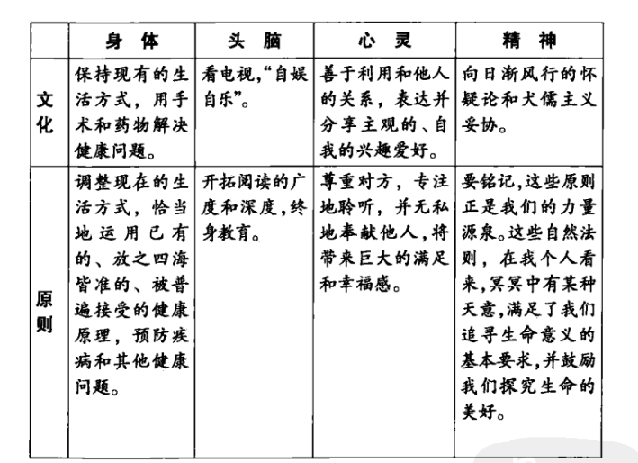

## 如何使用本书

1. 从头到尾浏览一遍，成长过程时时相伴，实践中不断扩展知识、技巧和想法
2. 吸收还要复述：在48小时内跟别人分享或讨论阅读心得

## 七个习惯的简要定义与架构图

1. **积极主动**：采取主动，为自己过去、现在及未来行为负责，并根据原则及价值观，而非情绪或外在环境来下决定。——自觉、良知、想象力和自主意识。创造自己的人生
2. **以终为始：**先拟出愿景和目标，并根据次塑造未来，全心投入自己最重视的原则、价值观、关系及目标。
3. **要事第一：**梦想（目标、愿景、价值观及要事处理熟悉怒）的组织与实践，次要的事不要摆在第一，要事不能摆在第二。
4. **双赢思维：**分享更多的机会、财富及资源。鼓励我们解决问题，并协助个人找到互惠的解决方法，是一种资讯、力量、认可及报酬的分享
5. **知己知彼：**诚心了解、聆听别人，开启真正的沟通，增进彼此关系。提升沟通效率。
6. **统合综效：**创造第三种更好的方法，互相尊重的结果——欣赏对方解决问题及把握机会的手法。1+1>2
7. **不断更新：**四个生活基本面（身体、精神、智力、社会/情感）中，不断更新自己

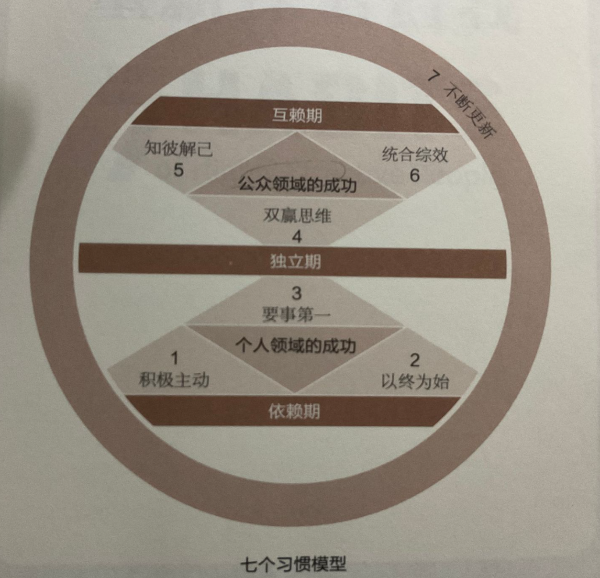

## 第1部分：重新探索自我

### 第一章 由内而外全面造就自己

要改变现状，先改变自己；要改变自己，先改变自己读问题的看法。

#### 品德与个人魅力孰重

**品德：**诚信、谦虚、忠诚、节欲、勇气、公正、耐心、勤勉、朴素等

**个人魅力**：性格、社会形象、行为态度、人机关系及长袖善舞的圆熟技巧

潜意识中受到速成观念的影响，忽略了幸福和快乐。应调整内心真正动机和看法。自动自发因素的作用要多于外在影响。凭借品德和个人魅力成功的天壤之别。

#### 光有技巧还不够

我们在前人的基础上施展个人能力，太过注重造就自己，忽略里前人基础的支撑。

只重技巧仿佛考前抱佛脚，没有日积月累的付出，无法学得精通。

倘若没有根深蒂固的诚信和基本的品德力量，生活的挑战迟早会让你真正的动机暴露无遗。

#### 思维定式的力量

思维定式：某种理论、模型、认知、假说或参考框架。我们“看”世界的方式(感知、理解与诠释)

走错路问题不在行为和态度，而在于那张错误的“地图”

对事物的看法决定我们的想法与行为

仅仅改变表明上的行为与态度，却忽略作为源头的思维定式，改变的成效一定有限。

认识到思维定式以及经验在我们身上的影响力，对思维定式负责，审视它，检验它，聆听和接受他人看法，从而获得更广阔的的视野和更客观的看法。

#### 思维转换的力量

某人从另一个角度看问题的顿悟感。

会让我们的世界观发生改变，决定我们的行为和态度，最终影响到我们的人际关系。

实质性的生活变化还是要靠思维的转换。

#### 身体力行

对待事物的方式和性格息息相关。

思维定式构成观察世界的窗口，思维转换是改变定式的力量。

#### 以原则为中心的思维定式

原则如灯塔，是不容动摇的自然法则。

* “公平”原则，平等与正义的理念
* “诚信”与“正直”原则：人类相互信任的基础
* “服务”原则：贡献自我
* “潜能”原则：人类可以不断成长、进步，释放潜能和施展才华。

实践是特定的行为或活动，是个别、具体的

原则是深刻、基本和普遍的。适用于任何个人、婚姻、家庭。内化为习惯，就能用不同的实践方式应对任何局面。

原则不是价值观，是人类行为的指南针。

思维定式月符合原则或自然法则，越能正确而高效的生活。

#### 成长和改变的原则

人的一生包含许多成长和进步阶段，必须循序渐进。

自然成长过程不容违背、忽略或缩短，智慧让你平添失望和挫败感。

承认自己的无知往往是求知的第一步。

或许只有真正经历过拥有，才会真正懂得分享。

教育孩子要有充分的耐心让他们体会拥有的感觉，同时用足够的智慧告诉他们付出的价值，另外还要以身作则。

#### 整洁在于治标不治本

个人魅力论的思维定式深刻的影响甚至决定我们看待问题和解决问题的方式。

需要更实质性的东西，需要过程，铲除病根，带来长期效益的原则。

#### 新的思想水平

基于原则的思维定式

由内而外实现个人效能和人机效能：从自身做起，从内心做起，包括思维定式、品德操守和动机。

个人领域的成功必须咸鱼公众领域的成功，只有对自己承诺，才能信守他人的承诺。

#### 付诸行动

**我们的思维定式，无论正确与否，是我们的态度与行为的根本，归根到底，是我们人际关系的根本**

我们越能意识到自己的思维定式或推测能力的局限，意识到我们在多大程度上受到过去经验的影响，越能直面自己的思维定式。

关注自己的思维定式——我们观察自己和周围世界的方式

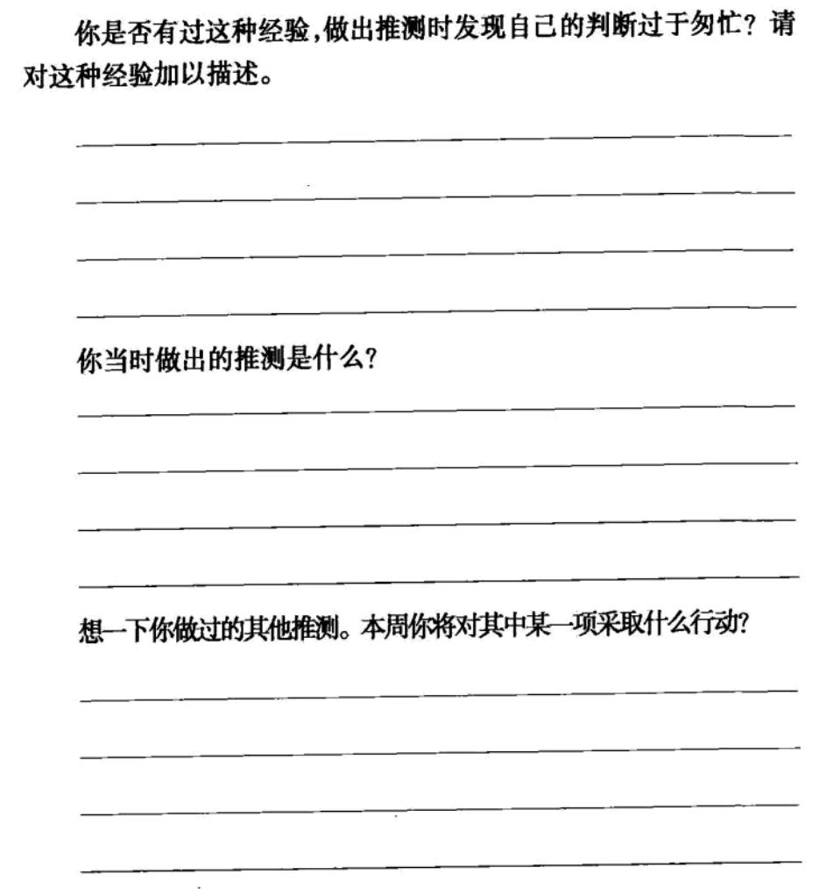

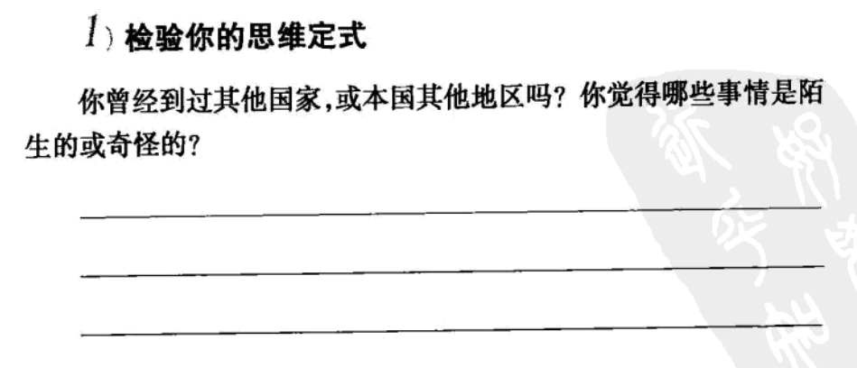

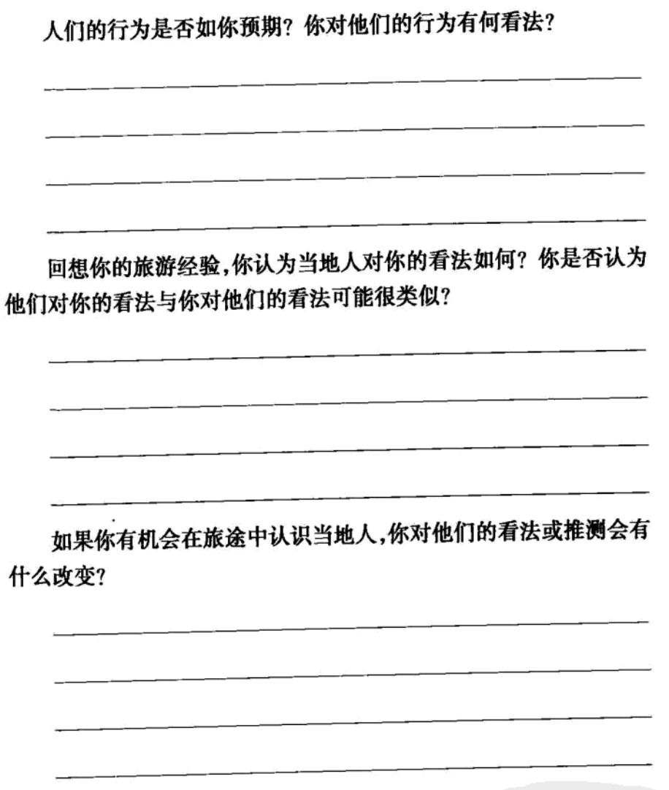

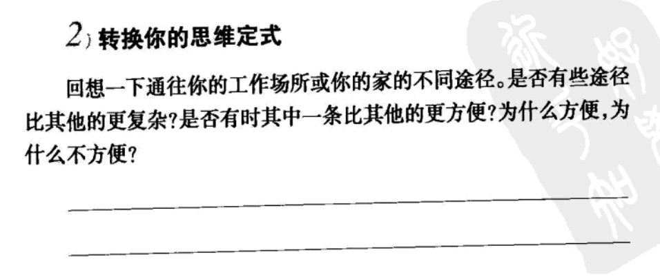

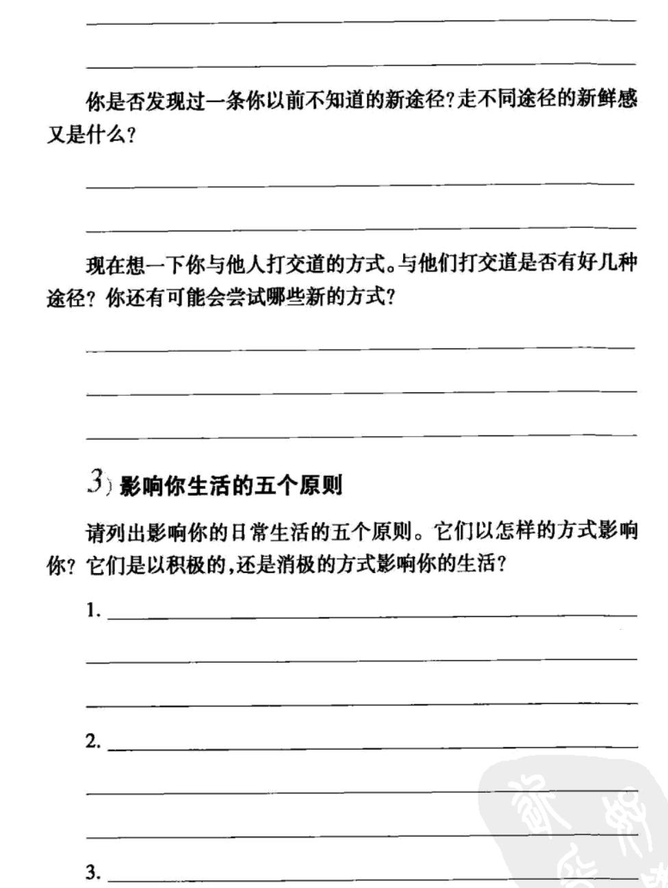

### 第二章：七个习惯概论

人的行为总是一再重复，因此卓越不是一时的行为，而是习惯——亚里士多德

品德是习惯的合成，习惯对生活有极大的影响。

利用习惯的“万有引力”让生活更有条理和秩序，也是提高效率的必备条件

#### “习惯”的定义

知识：理论范畴，做什么，为何做

技巧：如何做

意愿：促使 想要做

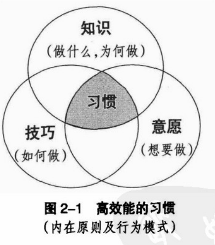

知道需要聆听和如何聆听是不够的，还需要愿意聆听，才能养成习惯。

为人和观念是螺旋上升的过程，为人改变观念，观念反过来改变为人。

#### 成熟模式图

依赖->独立->互赖 即人类成长的三个阶段

依赖：以“你”为核心——你照顾我，你为我的得失负责

独立：以“我”为核心——我可以做到，我可以负责，我可以靠自己，我有权选择

互赖：以“我们”为核心——我们可以做到，我们可以合作，我们可以融合彼此的智慧和能力，共创前程。

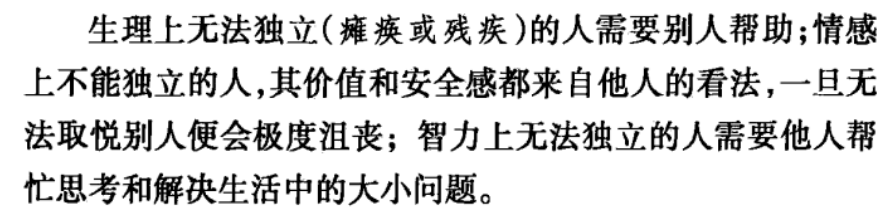	

真正独立的品德能让我们行事主动，摆脱对环境和他人的依赖，是值得追求的自由目标，但仍非高效能生活的最终目标

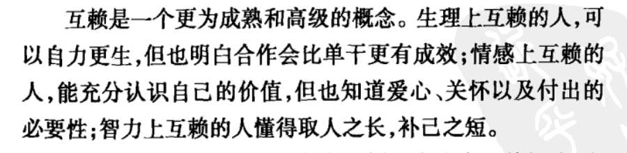

一个能做到互赖的人，既能与人深入交流自己的想法，也能看到他人的智慧和潜力。

只有独立的人才能选择互赖，尚未摆脱依赖的人无此条件。

成熟模型图如下：

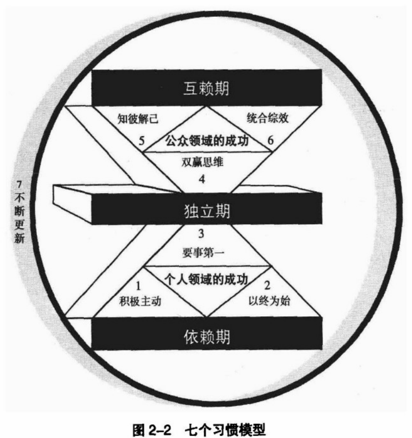

#### “效能”的定义

产出/产能平衡原则：**产出**相当于“金蛋”，**产能**相当于生产的资产或能力，即“下金蛋的鹅”

重蛋轻鹅：产金蛋的资产都保不住

重鹅轻蛋：可能活活饿死

P：希望获得的产出

PC：生产的资产或能力

#### 三类资产

物质资产：电动割草机没有及时保养，导致花更多钱和时间换一部新的。

金融资本：为了改善生活动用本金，利息越来越少。最重要的金融资本是赚钱能力

人力资本：人控制物质和金融资本。夫妻双方只想拿金蛋享受权益，不注意维护情感（权益的来源），长期会情感会逐渐衰退。权威式和纵容式的管教，都偏重于金蛋心态，忽略了那只鹅（子女的责任心，自律力和自信心）

```
案例：想保持房间整洁，想让子女整理，子女心甘情愿，则是一只会生金蛋的鹅，但是用威胁的方式，则牺牲了鹅的健康和幸福
```

#### 团体的产能

一个团队的成员在利用物质资产，不遵守产出与产能平衡，会降低整个团队的效能，最终导致鹅死亡。

唯有在金蛋和鹅的健康幸福取得平衡，才能实现真正的效能。

#### 付诸行动

**七个习惯是提高效能的习惯，真正的效能基于符合自然规律的永恒不变的原则。**

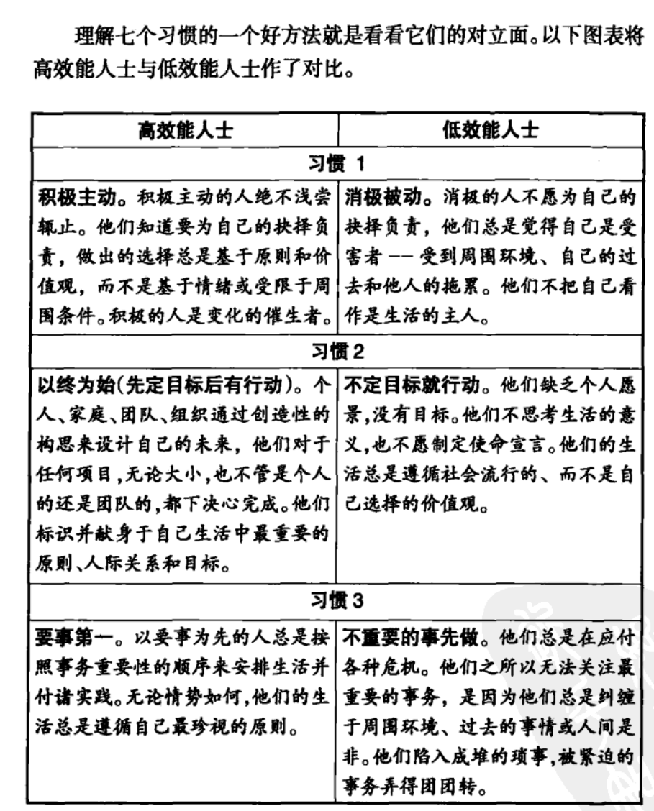

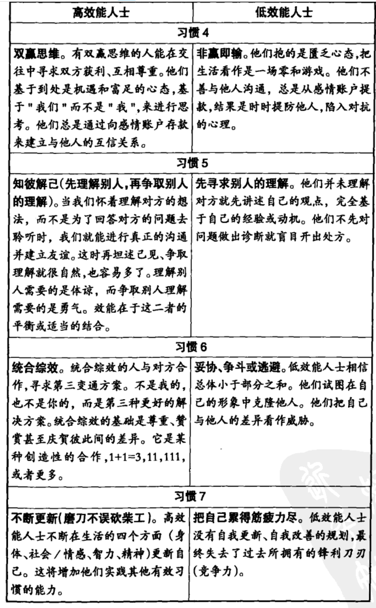

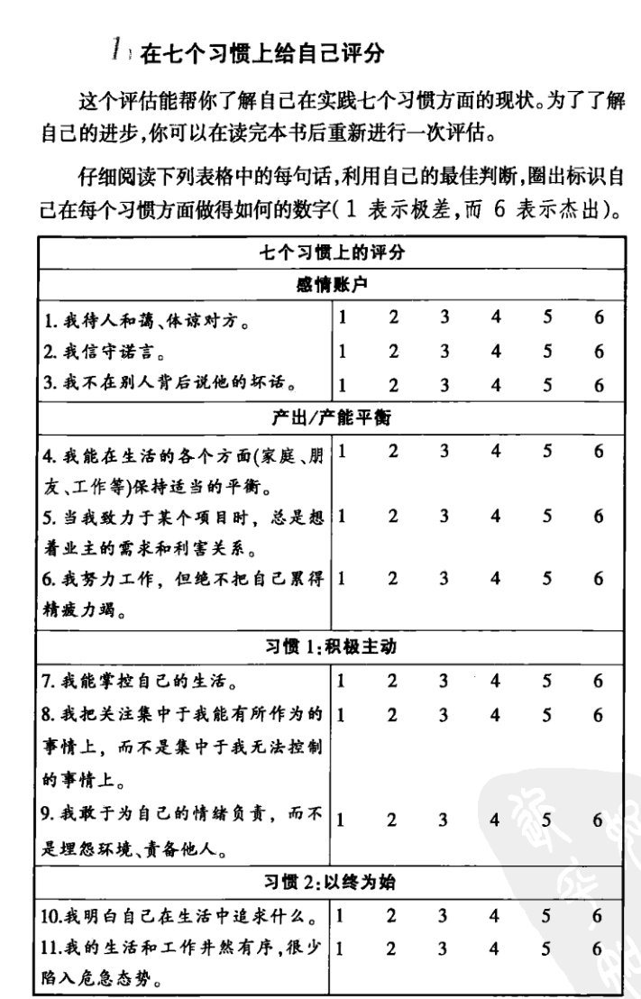

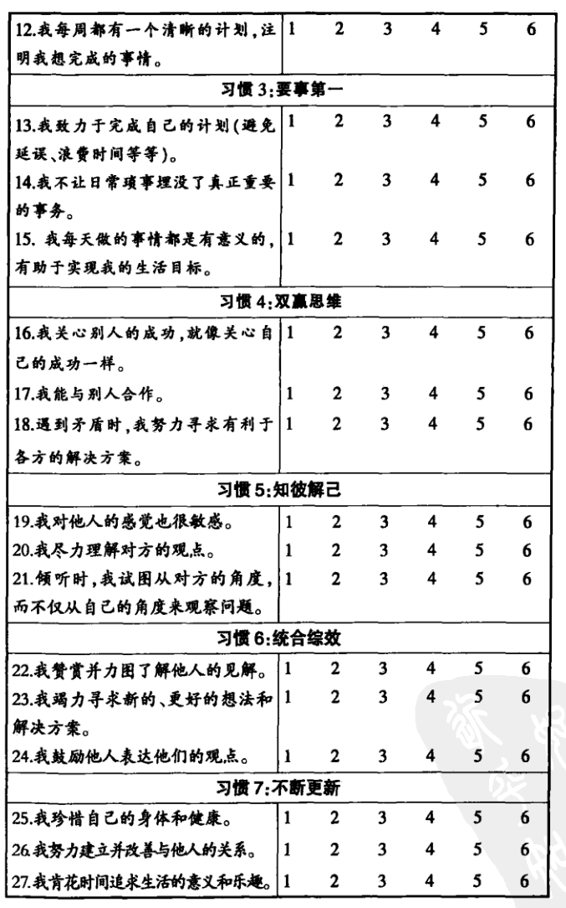	

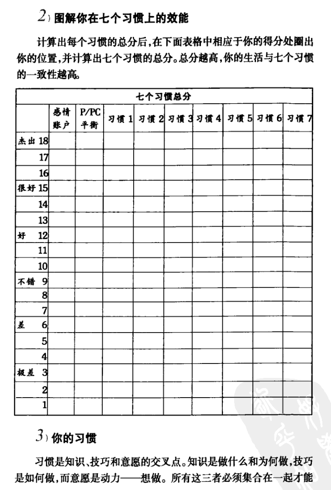

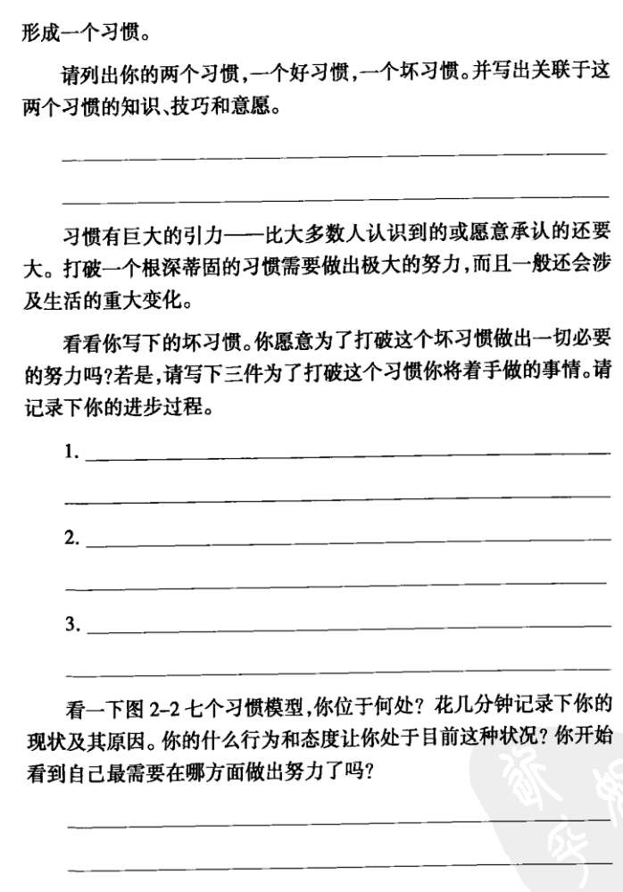

## 第2部分 个人领域的成功：从依赖到独立

### 第三章：习惯一 积极主动——个人愿景的原则

最令人鼓舞的事实，莫过于人类能够主动努力以提升生命价值——亨利·戴维·梭罗

